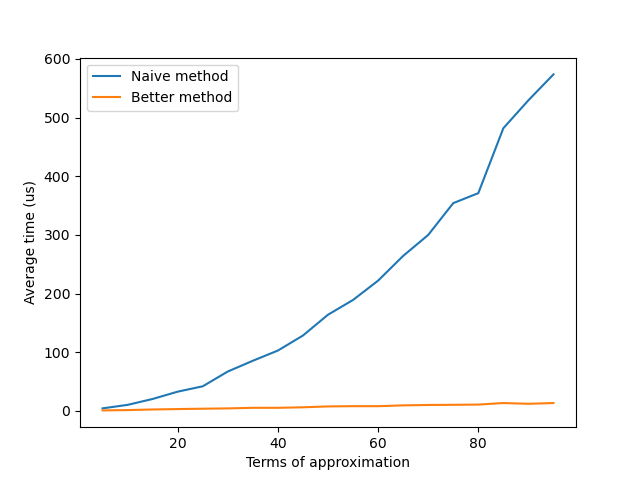

# Repeated Calculation Solutions

We saw from the ICT sheet that the Taylor Series expansion of the exponential
function can be written as the following infinite sum.

$$
\exp(x) = \sum_{n=0}^\infty \frac{1}{n!}x^n = 1 + x + \frac{x^2}{2} +
\frac{x^3}{6} + \dots
$$

Where the factorial is defined as the product expression.

$$
n! = \prod_{i=1}^{n} i = 1 \times 2 \times \dots \times (n-1) \times n
$$

You can see that, as $n$ increases, the time taken to compute each factorial
takes $\mathcal{O}(n)$ operations[^1], and this is only for a single term of
the Taylor Series! With $n$ terms in the Taylor Series, this takes us
$\mathcal{O}(n^2)$ operations to approximate the exponential function.

## An improvment

To do better, we can see that we re-calculate the same terms from the factorial
for each term in the Taylor Series. Expressed recursively, this gives us:

$$
n! = n\times(n-1)! \quad \text{or}\quad \frac{1}{n!} = \frac{1}{n} \times \frac{1}{(n-1)!}
$$

We can do a similar expression for the powers of $x$ we see in the Taylor
Series expansion!

$$
x^n = x \times x^{n-1}
$$

Then, the expansion of the exponential function can be written as

$$
\exp(x) = 1 + \frac{x}{1} + \left(\frac{x}{1} \times \frac{x}{2}\right) + \left(\frac{x}{1} \times \frac{x}{2} \times \frac{x}{3}\right) + \dots
$$

With the repeated calculations pulled out, hopefully you can now see how we can
implement this within a `for` loop in Python.

```python
term   = 1                  # Start with the 0th term
output = term               # Inlcude the 0th term

for term in range(1, n+1):  # Approximate using n terms (0th term already done)
    term   *= x / i         # Use the recursive definition of terms
    output += term          # Add the term to our approximation
```
Lets see how fast the better method is, compared to naively calculating the
Taylor Series expansion!




[^1]: This is similar notation to what you've seen previously, and means that
    the number of operations increases linearly with n